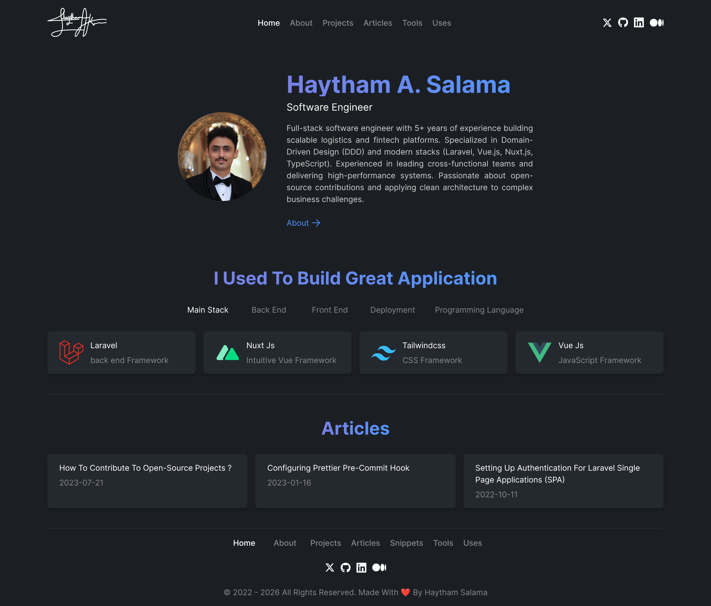

# haythamasalama.me

<p align="center">
  
</p>

<p align="center">
  Personal website of Haytham A. Salama — senior software engineer for SaaS, AI, fintech and logistics.
  <br><br>
  <samp>
    <a href="https://haythamasalama.me/projects">projects</a> ·
    <a href="https://haythamasalama.me/open-source">open source</a> ·
    <a href="https://haythamasalama.me/articles">writing</a> ·
    <a href="https://haythamasalama.me/snippets">snippets</a> ·
    <a href="https://haythamasalama.me/tools">tools</a> ·
    <a href="https://haythamasalama.me/uses">uses</a> ·
    <a href="https://haythamasalama.me/brand">brand</a>
  </samp>
</p>



## Stack

| | |
| --- | --- |
| Framework | [Nuxt 4](https://nuxt.com) (Vue 3.5, Vite) |
| Content | [Nuxt Content 3](https://content.nuxt.com) — typed collections, Shiki highlighting, Node's built-in SQLite |
| Styling | [Tailwind CSS 4](https://tailwindcss.com) with CSS-first theme tokens and `@tailwindcss/typography` |
| Icons | [Nuxt Icon](https://github.com/nuxt/icon) with local Lucide and Simple Icons collections |
| Fonts | Geist, Geist Mono and Instrument Serif, self-hosted from Fontsource |
| Theme | [@nuxtjs/color-mode](https://color-mode.nuxtjs.org) — dark by default, light on request |
| SEO | `useSeoMeta`, [@nuxtjs/sitemap](https://nuxtseo.com/sitemap) and [@nuxtjs/robots](https://nuxtseo.com/robots) |
| Quality | [@nuxt/eslint](https://eslint.nuxt.com) (flat config, ESLint 10) and `vue-tsc` |
| Live data | GitHub REST API (gists, pull requests, issues) through cached Nitro server routes |
| Hosting | Vercel — pages are prerendered; Home, Open source and Snippets use ISR and refresh from GitHub |

## Project structure

```
app/
  assets/css/main.css   Theme tokens (Ink, Iris, Azure), utilities and animations
  assets/icons/         Local icon collection (`brand:*`)
  components/           Layout pieces and small UI building blocks
  components/content/   Components used inside Markdown (code blocks, callouts)
  layouts/default.vue   Header, footer and the 880px page column
  pages/                One file per route
  composables/          Page SEO and the open-source data (`useOpenSource`)
  utils/                Signature strokes, logo registry, date and number helpers
server/
  api/snippets.get.ts   Public gists, rendered like article code blocks (cached 1 hour)
  api/open-source.get.ts  Merged pull requests, issues and contributor rank (cached 6 hours)
  utils/github.ts       GitHub API client
shared/
  tool-categories.ts    Areas and categories of the Tools page
  code-theme.ts         Brand code-highlighting themes (dark and light)
  types/                Types shared by the app, server and content schemas
content/                Everything you read on the site — Markdown and YAML
  articles/  projects/  experience/  education/
  contributions/  technologies/  tools/  uses/
content.config.ts       Collection schemas
public/brand-kit/       The downloadable brand kit
```

## Adding content

Most edits never touch code. Add a file and the page picks it up; the fields are validated by the schemas in `content.config.ts`.

- **Article**: `content/articles/<category>/<slug>.md` with `title`, `description`, `date` (`YYYY-MM-DD`), `category`, `icon` and `readingTime`.
- **Snippet**: publish a public [gist](https://gist.github.com/Haythamasalama). `/snippets` picks it up within the hour; Markdown gists render as guides, other files as code.
- **Open-source contribution**: nothing to do. Merged pull requests and issues on other people's repositories are read from GitHub every six hours. `content/contributions/` only holds what GitHub cannot say: maintainer roles, discussions and projects you started.
- **Project**: `content/projects/<slug>.yml`; add `highlight` to show it under "Selected work" on the home page.
- **Job or school**: a YAML file in `content/experience/` or `content/education/`.
- **Tool**: a YAML file in `content/tools/` whose `category` is one of the names in `shared/tool-categories.ts`. A new category is one line in that file.
- **Technology or something you use**: a YAML file in `content/technologies/` or `content/uses/`.
- **Company logo**: a one-colour PNG or SVG in `public/logos/`, registered in `app/utils/logos.ts`.

## Develop

Requires Node.js `22.22+` or `24.15+` (see `.nvmrc`).

```bash
git clone https://github.com/haythamasalama/haythamasalama.me.git
cd haythamasalama.me
npm install
npm run dev         # http://localhost:3000
```

| Script | |
| --- | --- |
| `npm run dev` | Start the dev server |
| `npm run build` | Production build |
| `npm run preview` | Preview the production build |
| `npm run lint` / `lint:fix` | ESLint |
| `npm run typecheck` | Type-check with `vue-tsc` |

### Configuration

All optional, as environment variables (for example in Vercel's project settings):

| Variable | |
| --- | --- |
| `NUXT_GITHUB_TOKEN` | A GitHub token (no scopes needed). Without it GitHub allows 60 API requests an hour per IP, which shared hosting can run out of. |
| `NUXT_GITHUB_USERNAME` | Whose gists and contributions to show. Defaults to `Haythamasalama`. |
| `NUXT_GITHUB_API_BASE` | GitHub API URL, e.g. a local mock while developing offline. |

CI runs lint, typecheck and build on every pull request. Project conventions for contributors and coding agents are in [AGENTS.md](AGENTS.md).

## Brand

The signature, colours, type and downloadable files live on the [brand guidelines](https://haythamasalama.me/brand) page and in [`public/brand-kit`](public/brand-kit).

## License

[MIT](LICENSE)
